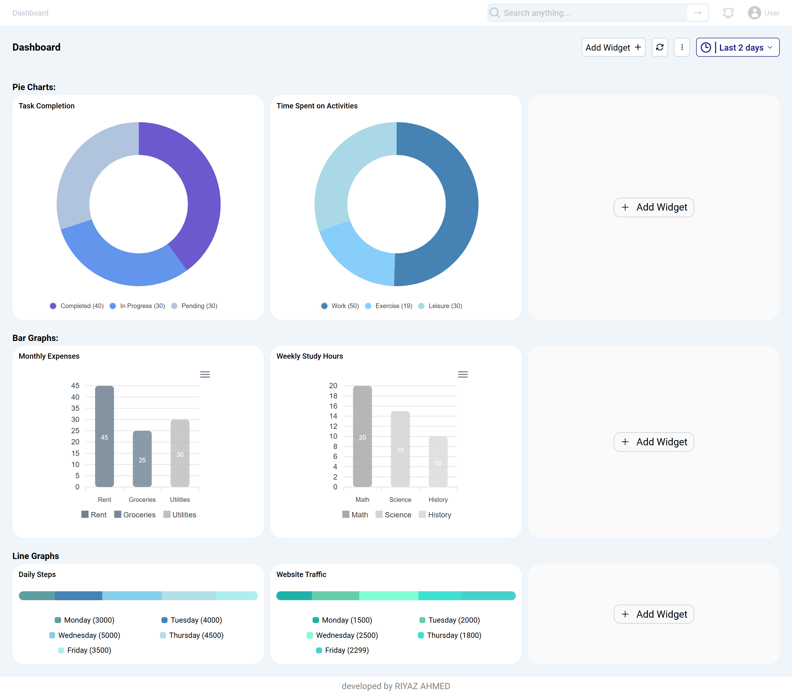
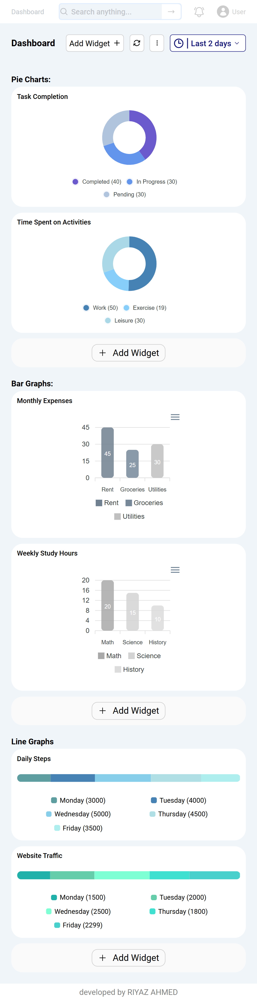
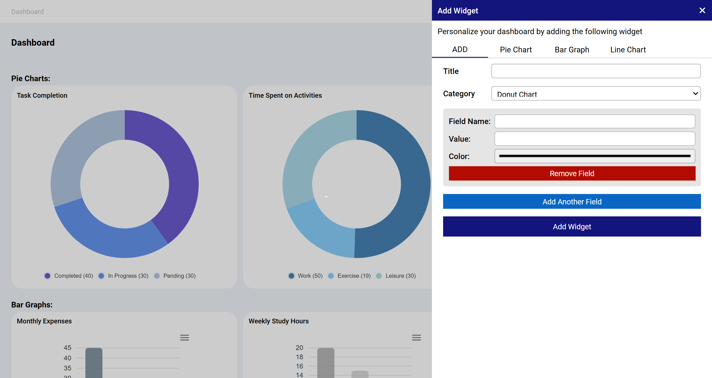
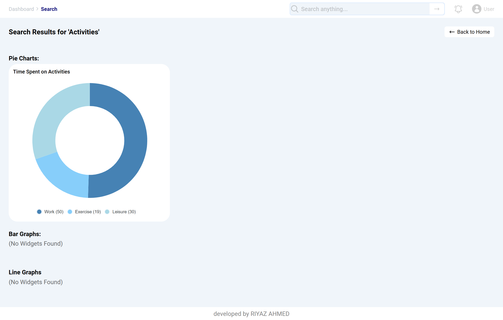

### Features
This website allows users to manage and visualize their data with interactive widgets. The key features include:
- Widget Types: Users can add and view Pie Charts, Bar Graphs, and Line Charts
- Customizable Colors: Choose colors for each widget to match your preferences
- Widget Management: Easily delete any widget when no longer needed
- Search Functionality: Find specific widgets quickly using the search feature


### Highlights
- Readable and Maintainable code
- Responsive design principles are applied
- Used React.memo, useMemo to avoid unnecessary re-renders and improve performance

### NOTE
- All the data is managed using Redux, which stores the data in the local storage of your browser. The data will not persist if you are accessing the application from another browser

## A sneak peek into what we have here!

Visit the website at: https://accuknox-assignment-kohl.vercel.app/

### Home Page (Desktp view)


### Home Page (Mobile view)


### Add Widget 


### Search Page 



## Technology Stack

- **Coding Languages**:   

- **Tools & Frameworks**:    

- **Project Management Tools**:  

<hr>

## Environment Setup for local use-

- Download and install a code/ text editor. - Recommended- - [Download VS Code](https://code.visualstudio.com/download) 
  <br/>

- Download [Node Js and npm(Node package manager)](https://nodejs.org/en/) (when you install Node, npm also gets installed by default)
  <br/>


- Download and extract the github repository
<br/>

- Open the project (Accuknox Assignment-main) using VS Code
  <br/>

- Open a new terminal and enter `cd frontend` to navigate to the front end of the project
<br/>

- Run this command to install all dependencies for the frontend of this project.

```
npm install
```

<br/>

- Now run this command to start the project.

```
npm run dev
```
<br/>

- Now you are all set to use this project.

## Developer

- Md Riyaz Ahmed